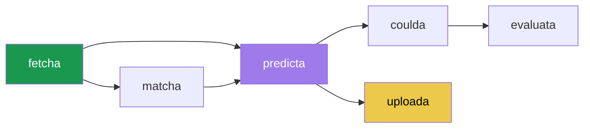

# PLL Fantasy Agent Workspace Setup & Index

Welcome! This workspace is designed for modeling, predicting, and optimizing rosters for the PLL Fantasy (F2P) platform.

Rather than loading all documentation into your context at once, this workspace uses modular **customization skills** located under `.agents/skills/`. The agent system automatically discovers and loads these skills dynamically based on your tasks.

> [!NOTE]
> **Script Path Convention**: All script and command references throughout the documentation (e.g., `01_fetch_f2p_costs.py`, `fetch_fantasy_points.py`, `06_optimize_lineups.py`) are relative to the workspace root directory (`f:/Google Drive/Documents/Hobbies/Lacrosse/PLL fantasy/scripts/`).

> [!IMPORTANT]
> **Git Command Convention**: When executing Git commands (e.g., staging files, committing, and pushing updates to GitHub), always invoke the standard system `git` command directly. Do **not** use the portable `scratch\mingit\cmd\git.exe` executable.
> **Explain Before Pushing**: Always clearly explain proposed changes to the user first before executing git commands to stage, commit, or push updates.

---

## 🗺️ Master Skills Directory

For detailed instructions and context on specific parts of the project, navigate to the relevant skill folder:

| Codename | Phase | What It Does | Skill File |
|---|---|---|---|
| **weekflow** | Meta | Weekly timeline & checklist — start here | [SKILL.md](file:///f:/Google%20Drive/Documents/Hobbies/Lacrosse/PLL%20fantasy/scripts/.agents/skills/weekly_workflow/SKILL.md) |
| **fetcha** | Phase 1 | Scrape F2P salaries, GraphQL stats, build unified dataset | [SKILL.md](file:///f:/Google%20Drive/Documents/Hobbies/Lacrosse/PLL%20fantasy/scripts/.agents/skills/data_fetching/SKILL.md) |
| **matcha** | Phase 1/3 | Manual defensive matchup tagging UI & server | [SKILL.md](file:///f:/Google%20Drive/Documents/Hobbies/Lacrosse/PLL%20fantasy/scripts/.agents/skills/matchup_tagger/SKILL.md) |
| **predicta** | Phase 2 | XGBoost classifier, Monte Carlo sims, Predicta UI | [SKILL.md](file:///f:/Google%20Drive/Documents/Hobbies/Lacrosse/PLL%20fantasy/scripts/.agents/skills/prediction_engine/SKILL.md) |
| **coulda** | Phase 3 | Retroactive optimal roster calculator | [SKILL.md](file:///f:/Google%20Drive/Documents/Hobbies/Lacrosse/PLL%20fantasy/scripts/.agents/skills/lineup_optimization/SKILL.md) |
| **evaluata** | Phase 3 | Ground truth tiers, MAE/RMSE error stats, Boom recall, MC roster scores (EV, Win_160, Ceil_90) | [SKILL.md](file:///f:/Google%20Drive/Documents/Hobbies/Lacrosse/PLL%20fantasy/scripts/.agents/skills/accuracy_evaluation/SKILL.md) |
| **uploada** | Phase 2/3 | Git push to GitHub Pages, offline cache refresh | [SKILL.md](file:///f:/Google%20Drive/Documents/Hobbies/Lacrosse/PLL%20fantasy/scripts/.agents/skills/deployment/SKILL.md) |
| **interrogata** | Always | Player career trend charts, matchup history | [SKILL.md](file:///f:/Google%20Drive/Documents/Hobbies/Lacrosse/PLL%20fantasy/scripts/.agents/skills/player_interrogator/SKILL.md) |
| **styla** | Always | Obsidian design system tokens & patterns | [SKILL.md](file:///f:/Google%20Drive/Documents/Hobbies/Lacrosse/PLL%20fantasy/scripts/.agents/skills/design_system/SKILL.md) |
| **improva** | Reference | Backlog, baselines, A/B testing rules | [SKILL.md](file:///f:/Google%20Drive/Documents/Hobbies/Lacrosse/PLL%20fantasy/scripts/.agents/skills/improvements_and_baselines/SKILL.md) |

---

## 📅 Master Weekly Workflow

The weekly workflow follows the league schedule and is divided into three major operational phases:

```
[Phase 1: Tuesday–Thursday] ──> [Phase 2: Friday (Game-Day -24h)] ──> [Phase 3: Monday (Post-Game)]
   - Fetch weekly salaries         - Official rosters published       - Fetch box stats (GraphQL)
   - Pre-matchup tagging           - Filter inactive players          - Retroactive "Coulda" run
   - Raw model predictions         - MC Simulations & EV Baking       - Accuracy evaluation
                                   - Static UI Compile & Git Push
```

For the step-by-step checklist and commands for each phase, check the [weekflow](file:///f:/Google%20Drive/Documents/Hobbies/Lacrosse/PLL%20fantasy/scripts/.agents/skills/weekly_workflow/SKILL.md) skill.

### Pipeline Dependency Flow



---

## ⚡ Quick Start (Most Common Commands)

### Run the full pre-game pipeline for Week N:
```bash
python 01_fetch_f2p_costs.py --week N
python 02_predict_probabilities.py --year 2026 --week N
python 03_apply_roster_filter.py --year 2026 --week N
python 04_simulate_monte_carlo.py --year 2026 --week N --sims 10000
python 05_bake_mc_ev.py 2026 N
python 07_prepare_static_data.py
```

### Run the full post-game pipeline:
```bash
python 01_fetch_f2p_costs.py --week N
python fetch_fantasy_points.py
python combine_datasets.py
python coulda_optimizer.py --year 2026 --week N
```

---

## 📖 Glossary of Terms

- **Coulda Max**: The absolute maximum fantasy points that could have been scored in a week under the F2P salary cap constraints, computed retroactively by `coulda_optimizer.py`.
- **Ceiling %**: The ratio of the actual selected lineup's score to the **Coulda Max** for that week (Actual / Coulda Max).
- **MC_EV**: Monte Carlo Expected Value strategy. Roster optimization objective that selects the lineup with the highest simulated mean points over 10,000 trials.
- **MC_Ceil_90**: Roster optimization objective that maximizes the 90th percentile of the simulated points distribution (high-upside tournament strategy).
- **MC_Win_160 / MC_Win_180**: Roster optimization objective that maximizes the probability of the lineup scoring at least 160 or 180 points in the simulations.
- **Boom / Average / Bust**: Ground-truth performance tiers assigned to active players dynamically. **Boom** represents the top 25% scorers for a position group in a week, **Average** is the middle 50%, and **Bust** is the bottom 25%.
- **Allowance Ratio**: The ratio of actual points scored to expected points based on matchups, representing opponent defensive strength. A ratio < 1.0 indicates a tough defense.
- **Gaussian Copula**: Mathematical structure used in Monte Carlo simulations to model dependencies and correlations (e.g. positive correlation between teammate shooters, negative correlation between face-off opponents or opposing goalies).

---

## 📂 Project Archive & backups

Original individual documentation files have been archived under:
*   [doc_backup/](file:///f:/Google%20Drive/Documents/Hobbies/Lacrosse/PLL%20fantasy/scripts/scratch/doc_backup/)
