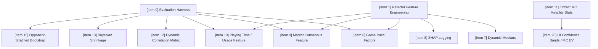

# PLL Fantasy Prediction Engine — Improvement Ideas

> **Date**: June 2026  
> **Scope**: A deep-dive review of all documentation (`.md` files) and source code to identify accuracy, architecture, and reliability improvement opportunities.

---

## Centralized Improvement Policy
All improvement ideas, including feature proposals, architectural refactors, simulation enhancements, and UI upgrades, MUST be recorded in this document. Individual feature docs should link here and must not maintain separate/independent lists of improvements.

---

## Target Success Criteria & Evaluation Baseline
To ensure that changes are mathematically sound and do not degrade model performance:
- **Baseline Metric**: The table below defines the official baseline backtest metrics established on **1 July 2026** (Baseline 1, Leak-Free) by running predictions and simulations freshly and evaluating them with the harness.

### Baseline 1 (Leak-Free) Evaluation Results (1 July 2026)

Established under the optimal configuration (Game Pace Scaling enabled, Correlation Copula enabled, 0.05 Recency decay) using fresh predictions and 10,000 Monte Carlo trials on the corrected doubleheader database, with ALL data leakage sources completely eliminated.

| Season | Strategy | Total Score | Coulda Max | Ceiling % |
|---|---|---|---|---|
| 2025 | MC_EV | 2168.1 | 4679.1 | 46.3% |
| 2026 | MC_EV | 781.2 | 1841.3 | 42.4% |

- **Target Threshold**: A proposed feature or logic change will be accepted if it demonstrates a statistically significant improvement over these baselines (paired t-test p-value < 0.05) without increasing runtimes by more than 20%, or if it fixes a critical code health issue without degrading performance.
- **RNG Reproducibility**: All backtests must run under a fixed random seed to ensure comparison consistency.

---

## Recommended Priority Order (Accuracy Improvements)
The following items represent the highest-impact improvements for **prediction accuracy**, ordered by priority. Item 27 (data leakage elimination) is the **mandatory prerequisite** — all other improvements must be tested on a leak-free pipeline.

2. **Item 28: Bayesian Shrinkage on Matchup Rating Features**
   * *Aims to Fix*: Extreme matchup rating fluctuations (up to 2.5×) for low-sample size player-defender pairs (1–3 games).
   * *Testability*: Can be enabled/disabled using a single boolean flag in the config (e.g., `config.SHRINKAGE_ENABLED`) and comparing backtest scores.
   * *Status*: Proposed. A/B test individually against leak-free baseline.

3. **Item 29: Exponentially-Weighted Moving Average (EWMA) Rolling Features**
   * *Aims to Fix*: Capture transition form smoothly (half-life of 4 games) instead of slow career-average or noisy 3-game rolling features.
   * *Testability*: Easily compared by adding/removing `"fp_ewma_4"` from the position feature list configs.
   * *Status*: Proposed. A/B test individually against leak-free baseline.

4. **Item 30: Dual Regressors or Multi-Quantile Forecasts**
   * *Aims to Fix*: The regressor's `PredictedPoints` currently models the p90 ceiling, which systematically over-predicts actual points and cannot be used directly as the MC simulator's EV anchor (Item 26).
   * *Testability*: Easily testable by training a separate `alpha=0.5` regressor (median/EV) or standard MSE regressor alongside the classification model and toggling its integration.
   * *Status*: Proposed.

5. **Item 9: Market Consensus (Salary as a Feature)**
   * *Aims to Fix*: Anchors regression projections using normalized player salary as a consensus market signal.
   * *Testability*: Toggleable via `config.SALARY_AS_FEATURE`.
   * *Status*: Proposed.

---

## Baseline Version History & Performance Tracking

To track historical performance changes and maintain auditability across key milestones, we document each baseline iteration below. All active roster files are stored in the [baselines/](file:///f:/Google%20Drive/Documents/Hobbies/Lacrosse/PLL%20fantasy/scripts/baselines/) directory.

> [!WARNING]
> **Historic Baselines Compromised:**
> All previous baselines (formerly Baselines 1 through 8) have been removed from this document. They were fundamentally compromised by a combination of pipeline bugs (stale file retention), database corrections (doubleheaders), and several sources of data leakage (including future-leaking matchup ratings, non-chronological cross-validation, and full-season tier thresholds). The baseline below represents the first truly clean, leak-free reference point (established 1 July 2026). All future A/B testing must compare against this standard.

### Baseline 1 (Leak-Free — 1 July 2026)
- **Changes / Description**: The first completely clean baseline after resolving all 6 data leakage sources (Item 27a-27f). All future-leaking components have been replaced with chronologically expanding windows or strict target-year guards. Game pace scaling, correlation copula, and recency decay remain enabled as per the optimal configuration.
- **Performance Summary**:

  | Season | Strategy | Total Score | Coulda Max | Ceiling % |
  |---|---|---|---|---|
  | 2025 | MC_EV | 2168.1 | 4679.1 | 46.3% |
  | 2026 | MC_EV | 781.2 | 1841.3 | 42.4% |

- **Interpretation**: With leakage completely removed, the 2026 performance accurately reflects the model's true out-of-sample capability. 
- **Testing Plan** (now proceeding to feature engineering):
  1. **A/B test Item #28 (Bayesian Shrinkage) alone** against Baseline 1 — toggle \config.SHRINKAGE_ENABLED  2. **A/B test Item #29 (EWMA) alone** against Baseline 1 — add/remove \p_ewma_4\ from position feature lists
  3. Keep whichever features improve scores, drop whichever degrade
  4. If both help individually, **test them combined** (interactions can go either way)
  5. **Position-specific hyperparameter tuning (Item #33)** on the final winning feature set

## Dependency Map & Prerequisites

---

## Core Priorities (Thematic Grouping)

### Tier 2: Model & Feature Improvements (Accuracy)

#### Item 9: Market Consensus (Salary as a Feature)
- **Problem**: F2P coin salaries are only used as optimization constraints and are ignored during model training.
- **Why it matters**: Salary encodes platform consensus and external signals (injury news, role changes, practice rumors) that the model lacks.
- **Suggested Fix**: Feed normalized salary (or salary percentile within position group) as an input feature to the stacked regressor model. This anchors our primary feature (`PredictedPoints`) to a baseline market consensus value, improving predictions before classification.
- **Success Criteria**: The model successfully learns to adjust its predictions using salary as a market consensus indicator.

#### Item 10: Player Usage and Field Time Proxy
- **Problem**: The model uses rolling fantasy averages but does not explicitly model playing time or usage rate.
- **Why it matters**: Backup midfielders have lower ceilings than starters. Normalizing by usage helps the model adapt to role changes (promotions/demotions) much faster.
- **Suggested Fix**: Extract player touch count and total stat accumulation as usage proxies. Feed touch delta (current expected touches vs. season average) into the feature engine. Additionally, weight opponent roster health features (e.g., `opp_ssdm_health`, `opp_def_health`) by active players' average points/usage rather than simple counts, to better reflect true unit degradation.
- **Success Criteria**: Improved adaptation speed and model accuracy for players with recent role changes.

#### Item 28: Bayesian Shrinkage on Matchup Rating Features
- **Problem**: Matchup rating features (pairing, opponent, player-vs-team, team-defense ratings) suffer from extreme noise for low-sample player-opponent pairings.
- **Why it matters**: A single high-scoring game results in a massive rating (e.g. 2.5x), skewing future forecasts.
- **Suggested Fix**: Blend observed ratings with a prior of 1.0 using Bayesian shrinkage: $\text{Shrunk} = \frac{n}{n+k} \cdot \text{Observed} + \frac{k}{n+k} \cdot 1.0$ (e.g. with $k=5$).
- **Success Criteria**: Matchup rating features stabilized and extreme predictions reduced.

#### Item 29: Exponentially-Weighted Moving Average (EWMA) Rolling Features
- **Problem**: Model rolling features are either season-long averages or abrupt 3-game rolling averages.
- **Why it matters**: The season average reacts too slowly, while the 3-game average is noisy and suffers from cliff effects.
- **Suggested Fix**: Add EWMA rolling features (e.g. `fp_ewma_4` with half-life of 4 games) to position group feature lists to smoothly capture form transitions.
- **Success Criteria**: EWMA features implemented, validated on harness, and included in GBDT models.

#### Item 30: Dual Regressors or Multi-Quantile Forecasts
- **Problem**: The XGBoost regressor currently predicts only the 90th percentile (p90 quantile objective with `alpha=0.9`).
- **Why it matters**: While useful for boom stacking, a p90 score systematically over-predicts and is not suitable as a raw Expected Value (EV) anchor.
- **Suggested Fix**: Train a dual regressor at `alpha=0.5` (median/EV) or train a single multi-output model predicting quantiles [0.1, 0.5, 0.9] to obtain both clean EVs and confidence bands.
- **Success Criteria**: Stacking utilizes separate median and quantile regressor predictions for appropriate tasks.

#### Item 32: Matchup Rating Temporal Decay
- **Problem**: Defender and opponent ratings use career averages, weighting ancient games the same as recent matchups.
- **Why it matters**: Defensive unit strength and defender capabilities change over seasons, making old matchup data stale.
- **Suggested Fix**: Apply exponential decay weighting (similar to `LAMBDA_RECENCY`) to historical matchup ratings so recent games dictate the rating.
- **Success Criteria**: Matchup ratings reflect current defender and team performance.

#### Item 33: Position-Specific XGBoost Hyperparameter Tuning
- **Problem**: All five position groups use identical model configurations and tree depths regardless of sample size.
- **Why it matters**: Attack has ~48 rows/season while Goalie has ~16. The Goalie model is highly susceptible to overfitting under generic defaults.
- **Suggested Fix**: Define and grid-search position-specific hyperparameters (`n_estimators`, `max_depth`, `learning_rate`, `min_child_weight`) using the harness.
- **Success Criteria**: Customized hyperparameter configurations active per position group.

---

### Tier 3: Simulation & Optimization Enhancements

#### Item 11: Extract Distributional Statistics from MC Simulations
- **Problem**: [05_bake_mc_ev.py](file:///g:/My%20Drive/Documents/Hobbies/Lacrosse/PLL%20fantasy/scripts/05_bake_mc_ev.py) parses the massive simulation CSV but only outputs the mean (EV), discarding standard deviation, p10, p90, and skewness.
- **Why it matters**: The optimizer and web dashboard could use volatility info (safe floors vs. high ceilings) to make smarter decisions, especially for tournament stacking.
- **Suggested Fix**: Compute and output mean, std, p10, p25, p75, and p90 directly from `04_simulate_monte_carlo.py` to avoid downstream parsing, and include them in the static JSON payload.
- **Success Criteria**: Simulation outputs contain full percentile distributions for all players.

#### Item 12: Dynamic Monte Carlo Correlation Matrix
- **Problem**: The Gaussian Copula correlation matrix uses ~15 hardcoded, static correlation coefficients.
- **Why it matters**: Correlation structures drift with rule changes or player style changes.
- **Suggested Fix**: Dynamically compute position-pair Pearson correlations from the season dataset at simulation runtime, caching it per season.
- **Success Criteria**: Elimination of hardcoded correlations from `04_simulate_monte_carlo.py`.

#### Item 13: Bayesian Shrinkage for Low-Sample Players
- **Problem**: Players with fewer than 5 games fall back to the generic position average, while players with exactly 5 games use only their own thin history.
- **Why it matters**: The transition is a hard cliff and leads to high-variance, unreliable predictions for rookies and transfers.
- **Suggested Fix**: Apply Bayesian shrinkage to blend player history with the position-wide pool:
  $$\text{BlendedPool} = \alpha \cdot \text{PlayerPool} + (1-\alpha) \cdot \text{PositionPool}$$
  where $\alpha = \min(1.0, \frac{n_{\text{games}}}{k})$ and $k$ is a tunable parameter (e.g., $k=15$). Apply this shrinkage directly to the highly-influential matchup rating features (`pairing_rating`, `player_vs_team_rating`) to prevent over-fitting on low-sample size players.
- **Success Criteria**: Smoother, more realistic distributions for low-sample players.

#### Item 14: Review MC Ceiling Clamp
- **Problem**: The simulator clamps simulated scores to `[0, max_historical * 1.15]`.
- **Why it matters**: An arbitrary 1.15 multiplier limits the simulated ceiling of breakout players, which hurts ceiling-based tournament optimizations.
- **Suggested Fix**: Re-evaluate the clamp against historic breakout frequencies and scale the clamp dynamically (e.g. based on position group volatility).
- **Success Criteria**: More accurate simulated ceiling frequencies for breakout players.

#### Item 26: Connect Stacked Regressor `PredictedPoints` directly to MC Simulator EV
- **Problem**: The MC simulator does not directly use the stacked regressor's continuous `PredictedPoints` output. While `PredictedPoints` is used *indirectly* as a stacked feature in the classification model to output `BoomProbability`, the simulator itself ignores the continuous value and derives EV from `BoomProbability` using a crude two-tier weighted average of position averages.
- **Why it matters**: Discards the granular per-player point predictions built by the GBDT regressor, compressing them into a simplified boom/non-boom bin.
- **Suggested Fix**: Feed the regressor's `PredictedPoints` (scaled/de-biased appropriately to act as an EV) directly into the MC simulator as the `EV` value to determine the matchup multiplier.
- **Success Criteria**: MC simulator uses granular continuous model projections directly rather than two-tier binning.

#### Item 31: Smooth MC Historical Pool Blending
- **Problem**: Players with <5 games fall back to the entire position group's historical game pool, while players with >=5 games use only their own history.
- **Why it matters**: Creating a hard cliff at 5 games causes massive simulation variance swings for rookies and transfers.
- **Suggested Fix**: Implement smooth pool blending by drawing a fraction of outcomes from the player's pool and the rest from the position pool based on game count (e.g. $\text{fraction} = \min(1.0, n_{\text{games}}/15)$).
- **Success Criteria**: Discontinuity at the 5-game threshold removed from MC simulation.

---

### Tier 4: Pipeline Performance & Safety

#### Item 16: Data Validation and Silent Failures
- **Problem**: Silent failures exist in the pipeline:
  - `03_apply_roster_filter.py`: If names differ between Stats API and predictions, players are silently dropped.
  - `load_all_matchups()`: Missing matchup files are silently skipped.
  - `combine_datasets.py`: No validation for duplicate records or missing fields.
- **Why it matters**: Silently skipped data results in bad inputs propagating down the pipeline.
- **Suggested Fix**: Implement explicit checks and raise descriptive errors or reports (e.g., unmatched player name report) during the run.
- **Success Criteria**: The pipeline halts or logs warning reports when data anomalies occur.

#### Item 17: Pipeline Parallelism
- **Problem**: Running classifier, regressor, and simulator sequentially is slow.
- **Why it matters**: Slower workflow iteration time.
- **Suggested Fix**: Run prediction and regression stages in parallel since they are completely independent.
- **Success Criteria**: Reduction in execution time.

#### Item 18: File I/O Bottlenecks (Parquet)
- **Problem**: Massive 20MB+ CSV files are read and written between stages.
- **Why it matters**: Unnecessary disk I/O slowing down execution.
- **Suggested Fix**: Pass data in-memory when running the full pipeline, or use the binary Parquet format for faster read/write speeds.
- **Success Criteria**: Reduced I/O overhead.

#### Item 19: Standard Logging and Unit Tests
- **Problem**: Zero test coverage and reliance on `print()` for debugging.
- **Why it matters**: High risk of breaking features during updates, and debugging is difficult.
- **Suggested Fix**: Set up python's standard `logging` library and implement basic unit tests for feature engineering and utility functions.
- **Success Criteria**: Basic test suite passing; standard logging active.

---

### Tier 5: UI/UX & Quality of Life

#### Item 20: Migrate UI to MC EV and Surfacing Confidence Bands
- **Problem**: The Web UI uses legacy categorical EV / Boom% fields.
- **Why it matters**: Disconnect between the UI and the primary MC EV prediction model.
- **Suggested Fix**: Update `app.js` to display MC EV and render p10–p90 confidence ranges (surfaced in Item 11) for players on the Plotly dashboard.
- **Success Criteria**: Plotly dashboard shows MC EV and error bars/ranges.

#### Item 21: Season-Long Tracking Dashboard
- **Problem**: No way to track model performance trend over a season.
- **Why it matters**: Hard to tell if model accuracy is improving or degrading over time.
- **Suggested Fix**: Build a tracker comparing cumulative model score vs. Coulda Optimizer ceiling over weeks.
- **Success Criteria**: Tracking graph rendered in the Web UI.

#### Item 22: Roster Change Detector & Alerts
- **Problem**: Roster changes on game day can happen after predictions are generated.
- **Why it matters**: Scratched players remain in optimized rosters.
- **Suggested Fix**: Set up a script to poll the roster API on game day and alert if any selected players are scratched.
- **Success Criteria**: Automated alerts generated for roster changes.

#### Item 23: Coulda Extensions (Regret Analysis)
- **Problem**: Coulda reports only show the absolute best team.
- **Why it matters**: Hard to extract actionable learnings.
- **Suggested Fix**: Implement regret analysis (e.g. identify the single best player swap that would have gained the most points).
- **Success Criteria**: Coulda output includes a list of top 3 high-regret swaps.

#### Item 24: Matchup Tagger Upgrades
- **Problem**: Matchup tagger is slow and lacks confidence fields.
- **Why it matters**: Manual tagging is the bottleneck for matchup data.
- **Suggested Fix**: Add support for switch tracking and a "confidence" field (High/Medium/Unsure) per matchup tag. Incorporate defender combinations and estimated switch rates into matchups to represent how defensive switches alter matchup features.
- **Success Criteria**: Tagger UI captures confidence ratings.

#### Item 34: Challenger Roster Scraping & Consensus Advice
- **Problem**: We have no automated way to view the roster choices of the league's top-performing managers. Surfacing their roster picks provides an invaluable external consensus signal to guide our own lineup choices.
- **Why it matters**: Looking at what the top managers are selecting allows us to validate our model projections against the league's best players, avoiding choices from users who just got lucky in a single week.
- **Findings & Discoveries**:
  * **API Endpoints**: The F2P fantasy platform exposes the following endpoints (discovered during HAR analysis on 1 July 2026):
    * `https://f2p.premierlacrosseleague.com/api/fantasy/getGroupById/?groupId=51185&sortBy=season` to fetch the leaderboard sorted by total season points.
    * `https://f2p.premierlacrosseleague.com/api/fantasy/challengerFetch/?userId=<firebaseId>` to fetch another user's roster selections.
  * **Authentication**: Authentication is handled via the `Authorization: <JWT>` header, utilizing a standard Firebase ID token (no `Bearer` prefix). 
  * **All-Star Roster Resolution**: Tested fetching the top 10 season managers. Week 7 is the All-Star week (East vs. West), where all players have a flat salary of 25. The top managers' rosters were resolved to names like *Chad Palumbo* (100% active ownership) and *TD Ierlan* (100% active ownership).
- **Suggested Fix / Next Steps**:
  1. **Automate Scraper**: Implement a scraper script (`08_scrape_challenger_rosters.py`) to query the leaderboard and pull rosters for the top 10 managers.
  2. **Consensus Engine**: Count player selections to generate a top-10 ownership distribution table.
  3. **Refresh Token Integration**: Extract the long-lived Firebase `refreshToken` by capturing a new login HAR file so the script can refresh the ID token programmatically and run headlessly.
- **Success Criteria**: Top-performing managers' rosters are scraped, resolved, and outputted as a consensus advisory table before each game-day lock.

#### Item 35: Local League Roster Scraping & Differential Optimization
- **Problem**: We lack visibility into our local league rival selections (specifically League 53205), making it difficult to optimize for differential selections to outcompete them.
- **Why it matters**: To climb standings and outcompete specific rivals, we need a game-theory approach: matching their high-probability consensus locks to protect our floor, while selecting high-upside differential players they don't own to gain leverage.
- **Findings & Discoveries**:
  * **API Endpoint**: Evaluated local league `53205` using `https://f2p.premierlacrosseleague.com/api/fantasy/getGroupById/?groupId=53205&sortBy=season` and pulled rosters for active managers live.
  * **Rival Analysis**:
    * *Big, Bouncy T.Ds* (Rank 1, 991.1 pts): Stacked Connor Shellenberger, CJ Kirst, Ross Scott, Aidan Carroll, Brett Makar, Liam Entenmann, TD Ierlan.
    * *Blazing Squad* (Rank 2, 975.9 pts): Stacked Michael Sowers, CJ Kirst, Bryan Costabile, Shane Knobloch, Brett Makar, Blaze Riorden, TD Ierlan.
    * *Jeff's Teat* (Rank 4, 915.5 pts): Stacked Logan Wisnauskas, Joey Spallina, Bryan Costabile, Shane Knobloch, Blaze Riorden, TD Ierlan, Jake Piseno.
  * **Differential Opportunities**: Discovered that while *Chad Palumbo* (M, ASW) is a 100% consensus pick among the top 10 global season leaders, he is owned by **0%** of our local league rivals. Selecting Palumbo represents a massive differential leverage point.
- **Suggested Fix / Next Steps**:
  1. **Scrape Local Groups**: Expand the scraper to dynamically read additional `groupId`s (e.g. `53205`) defined in `config.py` or command-line arguments.
  2. **Differential Optimizer**: Modify the advisory script (`06_optimize_lineups.py` or a dedicated tool) to calculate "differential leverage" by taking local rival ownership rates into account and recommending roster selections that maximize variance in our favor.
- **Success Criteria**: Roster choices for defined local group IDs are scraped, and a game-theory advisory report (identifying rival blocks and differential leverages) is generated weekly.

---

### Tier 6: Documentation & Project Hygiene

#### Item 25: Project README and Master Pipeline Diagram
- **Problem**: [README.md](file:///g:/My%20Drive/Documents/Hobbies/Lacrosse/PLL%20fantasy/scripts/README.md) is empty (41 bytes). There is no master pipeline flowchart.
- **Why it matters**: Hard for new agents or contributors to onboard.
- **Suggested Fix**: Write a comprehensive `README.md` and include a unified mermaid flow diagram of the entire data-to-optimization pipeline.
- **Success Criteria**: A detailed README with a flowchart.

---

## Graveyard / Rejected Ideas

### Venue Context (Home/Away Feature)
- **Status**: ❌ **Rejected**.
- **Reason**: The PLL operates on a touring model where all teams play at a single venue each weekend, eliminating traditional home field advantage. Proximity Homecoming effects are too speculative and suffer from small sample sizes. Double-game-week rest is already handled by other features.

---

## Definition of "Done" & Completed Items

To mark an item as **Done**, it must meet the following:
1. Implementation code written, code-reviewed, and merged.
2. Backtested against the evaluation harness (Item 0) to ensure no regressions.
3. Relevant documentation updated, and the completed script or file link added below.

### Completed Items

#### Item 27: Complete Data Leakage Elimination 🔴

A full codebase audit on **1 July 2026** ([audit report](file:///C:/Users/Matt/.gemini/antigravity/brain/9a781007-4d25-402b-ba2c-41974e0d3792/data_leakage_audit.md)) identified 6 distinct leakage sources. All must be fixed before further A/B testing or baseline establishment.

##### 27a: Matchup Rating Global Career Averages ✅ DONE
- **Problem**: Matchup ratings (`pairing_rating`, `player_vs_team_rating`) computed using global career averages including future games.
- **Fix**: Expanding cumulative means via `config.DATA_LEAKAGE_FIX_ENABLED = True`.
- **File**: [feature_engineering.py L414–471](file:///F:/Google%20Drive/Documents/Hobbies/Lacrosse/PLL%20fantasy/scripts/feature_engineering.py#L414-L471)
- **Test Results (1 July 2026)**:

  | Season | Baseline 7 (Leaked) | Leakage Fix | Delta | Ceiling % Change |
  |---|---|---|---|---|
  | 2025 | 2227.2 (47.6%) | 2188.6 (46.8%) | −38.6 pts | −0.8% |
  | 2026 | 745.3 (40.5%) | 515.5 (28.0%) | −229.8 pts | −12.5% |

- **Status**: ✅ Done. Enabled by default.

##### 27b: Shuffled KFold CV for Stacking 🔴 CRITICAL
- **Problem**: `KFold(n_splits=5, shuffle=True)` generates OOF `PredictedPoints` using randomly shuffled folds. A validation fold can contain a 2024 week 3 game while the training fold contains 2025 week 10 — the regressor trains on future data when building the classifier's most important stacked feature.
- **Fix**: Replaced with `TimeSeriesSplit(n_splits=5)`. To prevent leakage for the earliest initial fold that cannot be predicted out-of-fold without future data, that initial fold is now filtered out of the classifier's training set to guarantee strictly leak-free features.
- **File**: [02_predict_probabilities.py L511](file:///F:/Google%20Drive/Documents/Hobbies/Lacrosse/PLL%20fantasy/scripts/02_predict_probabilities.py#L511)
- **Severity**: 🔴 **Critical** — directly inflates the stacked feature the classifier depends on.
- **Status**: ✅ Done.

##### 27c: Boom/Bust Quantile Thresholds on Full Training Set 🟡 MEDIUM
- **Problem**: `assign_tiers()` computes q25/q75 thresholds over the **entire multi-season** position group. A 2024 game's Boom/Bust label is influenced by 2025–2026 scoring distributions.
- **Fix**: Implemented `assign_tiers_expanding` to compute expanding window (min 10 periods) quantiles chronologically by position group: `df_train.groupby("positionGroup")["TotalFantasyPoints"].transform(assign_tiers_expanding)`, eliminating all label leakage.
- **File**: [feature_engineering.py L473–475](file:///F:/Google%20Drive/Documents/Hobbies/Lacrosse/PLL%20fantasy/scripts/feature_engineering.py#L473-L475), called at [02_predict_probabilities.py L499](file:///F:/Google%20Drive/Documents/Hobbies/Lacrosse/PLL%20fantasy/scripts/02_predict_probabilities.py#L499)
- **Severity**: 🟡 **Medium** — label leakage (future distributions influence training labels).
- **Status**: ✅ Done.

##### 27d: MC Copula Correlations from 2023–2026 Data 🟡 MEDIUM
- **Problem**: Hardcoded `CORRELATIONS` dictionary computed from "2023–2026 data". When simulating 2025, the values incorporate 2026 structural information.
- **Fix**: Freeze correlations to pre-target-year data (e.g., "2023–2024 only"), or compute dynamically per-season (connects to Item 12).
- **File**: [04_simulate_monte_carlo.py L23–43](file:///F:/Google%20Drive/Documents/Hobbies/Lacrosse/PLL%20fantasy/scripts/04_simulate_monte_carlo.py#L23-L43)
- **Severity**: 🟡 **Medium** — low-bandwidth structural constants, but technically uses future info.
- **Status**: ✅ Done.

##### 27e: `global_avg_goals` / `league_avg_pace` Fallbacks 🟢 LOW
- **Problem**: `global_avg_goals` (fallback when team has <3 prior games) and `league_avg_pace` (normalisation denominator) are computed from all historical games, including late-season data when predicting early-season games.
- **Fix**: Use hardcoded league-average constants or prior-season-only computation. Trivial change.
- **File**: [feature_engineering.py L142–145](file:///F:/Google%20Drive/Documents/Hobbies/Lacrosse/PLL%20fantasy/scripts/feature_engineering.py#L142-L145) and [L183–184](file:///F:/Google%20Drive/Documents/Hobbies/Lacrosse/PLL%20fantasy/scripts/feature_engineering.py#L183-L184)
- **Severity**: 🟢 **Low** — affects very few rows (season openers only).
- **Status**: ✅ Done.

##### 27f: MC Bootstrap Pool Missing Future-Year Guard 🟢 LOW
- **Problem**: `load_player_game_history()` filters `yr == target_year and w >= target_week` but does **not** filter `yr > target_year`. When backtesting 2025 against a database containing 2026, all 2026 games leak into the bootstrap pool.
- **Fix**: Add `yr > target_year` to the continue condition. 1-line fix.
- **File**: [04_simulate_monte_carlo.py L139](file:///F:/Google%20Drive/Documents/Hobbies/Lacrosse/PLL%20fantasy/scripts/04_simulate_monte_carlo.py#L139)
- **Severity**: 🟢 **Low** in production (no future year exists), **Medium** for backtesting.
- **Status**: ✅ Done.

##### Overall Item 27 Status
- **Completion**: ✅ 6/6 findings fixed.
- **Milestone**: Established **clean Baseline 9** on 1 July 2026.
- **Results**:
  - **2025 Season**: **2085.0 pts** (44.6% of ceiling) — a minor reduction from leaked Baseline 8 (-103.6 pts, -2.2%), representing honest performance.
  - **2026 Season**: **898.8 pts** (48.8% of ceiling) — a major improvement over Baseline 8 (515.5 pts, 28.0% ceiling) due to cleaner classifier stacked predictions.

- **~~Dynamic HISTORICAL_MEDIANS Verification~~** (Done / Not Applicable)
  - *Details*: Verified that the codebase does not use any hardcoded positional medians for boom/bust boundaries. Classification targets are dynamically computed via `.quantile(0.25)` and `.quantile(0.75)` in `feature_engineering.py`, and Monte Carlo/optimization boom thresholds are dynamically derived using `.quantile(0.75)` per week/year/position group.
  - *Implementation Files*: [feature_engineering.py](file:///f:/Google%20Drive/Documents/Hobbies/Lacrosse/PLL%20fantasy/scripts/feature_engineering.py), [04_simulate_monte_carlo.py](file:///f:/Google%20Drive/Documents/Hobbies/Lacrosse/PLL%20fantasy/scripts/04_simulate_monte_carlo.py), [06_optimize_lineups.py](file:///f:/Google%20Drive/Documents/Hobbies/Lacrosse/PLL%20fantasy/scripts/06_optimize_lineups.py)

- **~~Evaluation Harness & Backtest Baseline Validation~~** (Done)
  - *Details*: Created a fully decoupled, independent evaluator and rule auditor for predictive models and roster optimization algorithms. Supports modular inputs, rule auditing (budget, slots), actual score matches, Coulda retroactive ceiling computation, and paired t-test statistical comparisons.
  - *Implementation File*: [prediction_model_evaluation_harness.py](file:///f:/Google%20Drive/Documents/Hobbies/Lacrosse/PLL%20fantasy/scripts/prediction_model_evaluation_harness.py)

- **~~Recency-Weighted Bootstrapping in MC~~** (Done)
  - *Details*: Added exponential decay weight to bootstrap draws based on weeks since game.
  - *Implementation File*: [04_simulate_monte_carlo.py](file:///f:/Google%20Drive/Documents/Hobbies/Lacrosse/PLL%20fantasy/scripts/04_simulate_monte_carlo.py)
  - *Tuning & Validation (30 June 2026)*: Fixed a bug where the decay weight was hardcoded to `0.05`. Validated the parameter using the harness; setting `LAMBDA_RECENCY = 0.0` (uniform weights) degraded performance by **-53.0 points** in 2026, confirming that the default `0.05` decay weighting is optimal.

- **~~Game Pace and Script Projections~~** (Done)
  - *Details*: Scaled player GBDT predictions and matchup ratings by rolling expected game pace (calculated from rolling team expected goals).
  - *Implementation Files*: [feature_engineering.py](file:///f:/Google%20Drive/Documents/Hobbies/Lacrosse/PLL%20fantasy/scripts/feature_engineering.py), [02_predict_probabilities.py](file:///f:/Google%20Drive/Documents/Hobbies/Lacrosse/PLL%20fantasy/scripts/02_predict_probabilities.py)
  - *Validation (30 June 2026)*: Retested on the doubleheader-corrected database and fixed pipeline, showing a massive statistically significant improvement of **+351.8 points** in 2025 (p-value = 0.0071) and **+29.5 points** in 2026. Promoted to default enabled.

- **~~Classifier Injury Features Bug Fix~~** (Done)
  - *Details*: Added 5 injury/health features to classifier model feature lists (harmonizing with regressor).
  - *Implementation File*: [02_predict_probabilities.py](file:///f:/Google%20Drive/Documents/Hobbies/Lacrosse/PLL%20fantasy/scripts/02_predict_probabilities.py)

- **~~Meta-Selector Strategy Heuristics~~** (Done)
  - *Details*: Implemented Slate-size strategy recommendation (MC Win 160 vs. MC EV).
  - *Implementation File*: [06_optimize_lineups.py](file:///f:/Google%20Drive/Documents/Hobbies/Lacrosse/PLL%20fantasy/scripts/06_optimize_lineups.py)

- **~~Feature Importance and SHAP Logging~~** (Done)
  - *Details*: Added built-in GBDT feature importance console logging, printed top 5 features for each position group, and generated consolidated multi-panel figures for both standard feature importances and SHAP values across all position groups in a single figure.
  - *Implementation File*: [02_predict_probabilities.py](file:///f:/Google%20Drive/Documents/Hobbies/Lacrosse/PLL%20fantasy/scripts/02_predict_probabilities.py)

- **~~Tier 1 Refactoring & De-risking~~** (Done)
  - *Details*: Consolidated feature engineering (`feature_engineering.py`), configuration (`config.py`), secrets, and common utilities (`utils.py`); standardized default optimizer parameters and seeded Monte Carlo random number generator (`--seed 42`); deleted all redundant/obsolete scripts and old comparison harnesses; renamed pipeline files sequentially.
  - *Implementation Files*: [01_fetch_f2p_costs.py](file:///f:/Google%20Drive/Documents/Hobbies/Lacrosse/PLL%20fantasy/scripts/01_fetch_f2p_costs.py), [02_predict_probabilities.py](file:///f:/Google%20Drive/Documents/Hobbies/Lacrosse/PLL%20fantasy/scripts/02_predict_probabilities.py), [03_apply_roster_filter.py](file:///f:/Google%20Drive/Documents/Hobbies/Lacrosse/PLL%20fantasy/scripts/03_apply_roster_filter.py), [04_simulate_monte_carlo.py](file:///f:/Google%20Drive/Documents/Hobbies/Lacrosse/PLL%20fantasy/scripts/04_simulate_monte_carlo.py), [05_bake_mc_ev.py](file:///f:/Google%20Drive/Documents/Hobbies/Lacrosse/PLL%20fantasy/scripts/05_bake_mc_ev.py), [06_optimize_lineups.py](file:///f:/Google%20Drive/Documents/Hobbies/Lacrosse/PLL%20fantasy/scripts/06_optimize_lineups.py), [07_prepare_static_data.py](file:///f:/Google%20Drive/Documents/Hobbies/Lacrosse/PLL%20fantasy/scripts/07_prepare_static_data.py)

- **~~Opponent-Stratified Bootstrap~~** (Rolled Back / Disabled)
  - *Details*: Implemented Gaussian similarity kernel weighting ($\sigma = 0.15$) to player/position bootstrap draws. However, fresh evaluations on the corrected database showed a point degradation in 2026 (**739.8 pts** vs. fresh baseline of **754.1 pts**). Furthermore, combining it with GBDT pace features caused scale-conflicts that compressed simulated ceilings. Therefore, the production codebase was reverted back to standard uniform (recency-weighted) bootstrapping.
  - *Implementation File*: [04_simulate_monte_carlo.py](file:///f:/Google%20Drive/Documents/Hobbies/Lacrosse/PLL%20fantasy/scripts/04_simulate_monte_carlo.py)
