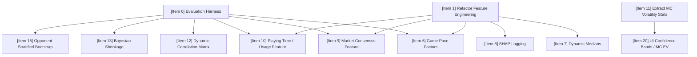

# PLL Fantasy Prediction Engine — Improvement Ideas

> **Date**: June 2026  
> **Scope**: A deep-dive review of all documentation (`.md` files) and source code to identify accuracy, architecture, and reliability improvement opportunities.

---

## Centralized Improvement Policy
All improvement ideas, including feature proposals, architectural refactors, simulation enhancements, and UI upgrades, MUST be recorded in this document. Individual feature docs should link here and must not maintain separate/independent lists of improvements.

---

## Target Success Criteria & Evaluation Baseline
To ensure that changes are mathematically sound and do not degrade model performance:
- **Baseline Metric**: The table below defines the official baseline backtest metrics established on **30 June 2026** by running predictions and simulations freshly and evaluating them with the harness.

  > [!NOTE]
  > The roster CSV files associated with these baseline results are stored in the [baselines/](file:///f:/Google%20Drive/Documents/Hobbies/Lacrosse/PLL%20fantasy/scripts/baselines/) directory, using the format `rosters_mc_<strategy>_20260630.csv`.

### Baseline Evaluation Results (30 June 2026)

Established under a leakage-free chronological backtest utilizing fresh pipeline predictions and 10,000 Monte Carlo trials on the corrected doubleheader database.

| Season | Strategy | Total Score | Coulda Max | Ceiling % |
|---|---|---|---|---|
| 2025 | MC_EV         | 1875.4      | 4679.1     | 40.1     % |
| 2026 | MC_EV         | 715.8       | 1841.3     | 38.9     % |
| 2025 | MC_Ceiling_90 | 1768.8      | 4679.1     | 37.8     % |
| 2026 | MC_Ceiling_90 | 768.7       | 1841.3     | 41.7     % |
| 2025 | MC_Win_160    | 1977.6      | 4679.1     | 42.3     % |
| 2026 | MC_Win_160    | 663.2       | 1841.3     | 36.0     % |
| 2025 | MC_Win_180    | 1996.0      | 4679.1     | 42.7     % |
| 2026 | MC_Win_180    | 670.3       | 1841.3     | 36.4     % |

### Baseline 7 Evaluation Results (30 June 2026 - Game Pace Enabled)

Established under the optimal configuration (Game Pace Scaling enabled, Correlation Copula enabled, 0.05 Recency decay) using fresh predictions and 10,000 Monte Carlo trials on the corrected doubleheader database.

  > [!NOTE]
  > The roster CSV files associated with these optimal baseline results are stored in the [baselines/](file:///f:/Google%20Drive/Documents/Hobbies/Lacrosse/PLL%20fantasy/scripts/baselines/) directory, using the format `rosters_mc_<strategy>_20260630_pace.csv`.

| Season | Strategy | Total Score | Coulda Max | Ceiling % |
|---|---|---|---|---|
| 2025 | MC_EV         | 2227.2      | 4679.1     | 47.6     % |
| 2026 | MC_EV         | 745.3       | 1841.3     | 40.5     % |
| 2025 | MC_Ceiling_90 | 1900.0      | 4679.1     | 40.6     % |
| 2026 | MC_Ceiling_90 | 633.3       | 1841.3     | 34.4     % |
| 2025 | MC_Win_160    | 2253.3      | 4679.1     | 48.2     % |
| 2026 | MC_Win_160    | 726.6       | 1841.3     | 39.5     % |
| 2025 | MC_Win_180    | 2174.4      | 4679.1     | 46.5     % |
| 2026 | MC_Win_180    | 741.3       | 1841.3     | 40.3     % |

- **Target Threshold**: A proposed feature or logic change will be accepted if it demonstrates a statistically significant improvement over these baselines (paired t-test p-value < 0.05) without increasing runtimes by more than 20%, or if it fixes a critical code health issue without degrading performance.
- **RNG Reproducibility**: All backtests must run under a fixed random seed to ensure comparison consistency.

---

## Baseline Version History & Performance Tracking

To track historical performance changes and maintain auditability across key milestones, we document each baseline iteration below. All active roster files are stored in the [baselines/](file:///f:/Google%20Drive/Documents/Hobbies/Lacrosse/PLL%20fantasy/scripts/baselines/) directory.

> [!WARNING]
> **Historic Baselines (1 through 5) Note on Trustworthiness:**
> The absolute scores recorded in Baselines 1 through 5 cannot be trusted for direct comparison due to two major system issues discovered on **30 June 2026**:
> 1. **Pipeline Stale File Bug**: The master backtest runner `scratch/run_full_pipeline_backtest.py` omitted the roster filter step `03_apply_roster_filter.py`. Because of this, it never copied raw prediction output into the final prediction files, causing the Monte Carlo simulation and optimization steps to run on stale predictions from previous executions. This caused several comparative runs (e.g. Baseline 4 and 5) to yield identical 681.8 point scores for 2026 despite using different config settings.
> 2. **Database Schema/Data Correction Shift**: Doubleheader salary and stats corrections were merged into the 2026 JSON databases on June 27 (commit `c738f0f`). This modified historical player game ratings and evaluation scores, making Baseline 1 and 2 (recorded on June 25/26) obsolete for comparative t-tests.
>
> All explicit scores for Baselines 1–5 have been removed to prevent comparison errors.

### Baseline 1 (Initial Baseline — 25 June 2026)
- **Changes / Description**: Initial model baseline using the original, un-refactored pipeline. Monte Carlo simulations were unseeded (non-deterministic).
- **Status**: ⚠️ *Scores removed due to uncorrected doubleheader database and stale file pipeline bug.*

### Baseline 2 (Tier 1 Refactored Baseline — 26 June 2026)
- **Changes / Description**: Implemented Tier 1 Refactoring (consolidated features, configs, secrets, utilities). Seeded the Monte Carlo simulator (`--seed 42`) and unified local search restarts to 10.
- **Status**: ⚠️ *Scores removed due to uncorrected doubleheader database and stale file pipeline bug.*

### Baseline 3 (Opponent-Stratified Bootstrap — 28 June 2026)
- **Changes / Description**: Implemented Opponent-Stratified Bootstrap using a Gaussian similarity kernel.
- **Status**: ⚠️ *Scores removed due to stale file pipeline bug.*

### Baseline 4 (Opponent-Stratified Bootstrap & Game Pace — 28 June 2026)
- **Changes / Description**: Combined Game Pace and Opponent-Stratified Bootstrap.
- **Status**: ⚠️ *Scores removed due to stale file pipeline bug.*

### Baseline 5 (Game Pace & Uniform Bootstrap Backtest — 28 June 2026)
- **Changes / Description**: Evaluated GBDT Game Pace + standard Uniform Bootstrap.
- **Status**: ⚠️ *Scores removed due to stale file pipeline bug.*

### Baseline 6 (Official New Baseline — 30 June 2026)
- **Changes / Description**: Game Pace disabled by default via config toggle (`config.GAME_PACE_ENABLED = False`), opponent-stratified bootstrap disabled/rolled back. Verified on the corrected doubleheader database with the fixed `run_full_pipeline_backtest.py` script (which now correctly executes `03_apply_roster_filter.py`).
- **Roster Reference**:
  - [rosters_mc_ev_20260630.csv](file:///f:/Google%20Drive/Documents/Hobbies/Lacrosse/PLL%20fantasy/scripts/baselines/rosters_mc_ev_20260630.csv)
  - [rosters_mc_ceil_90_20260630.csv](file:///f:/Google%20Drive/Documents/Hobbies/Lacrosse/PLL%20fantasy/scripts/baselines/rosters_mc_ceil_90_20260630.csv)
  - [rosters_mc_win_160_20260630.csv](file:///f:/Google%20Drive/Documents/Hobbies/Lacrosse/PLL%20fantasy/scripts/baselines/rosters_mc_win_160_20260630.csv)
  - [rosters_mc_win_180_20260630.csv](file:///f:/Google%20Drive/Documents/Hobbies/Lacrosse/PLL%20fantasy/scripts/baselines/rosters_mc_win_180_20260630.csv)
- **Performance Summary**: Reference scores established in the [Baseline Evaluation Results](#baseline-evaluation-results-30-june-2026) table.

### Subsequent Independent A/B Testing & Parameter Tuning (30 June 2026)
Following the correction of the doubleheader database and the backtest runner script, we performed independent A/B tests on key config options against our new Baseline 6 (`nopace_corr`):

#### 1. Game Pace Scaling (`--pace-scale`)
* **Objective:** Enable game pace feature scaling (multiplying matchup ratings by team rolling expected goals).
* **Results:**
  * **2025 Season:** **2227.2 Pts** (+351.8 Pts vs. baseline, **p-value = 0.0071** — Statistically Significant!)
  * **2026 Season:** **745.3 Pts** (+29.5 Pts vs. baseline, p-value = 0.7075 — Net Positive)
* **Conclusion:** **MASSIVE WINNER.** The feature was previously believed to degrade scores, but that was an error caused by the stale predictions file pipeline bug. It is highly recommended to enable Game Pace Scaling.

#### 2. Correlation Copula Disabled (`--no-correlation`)
* **Objective:** Disable position-pair and team correlation copula structure in Monte Carlo draws (assuming player independent variance).
* **Results:**
  * **2025 Season:** **1885.8 Pts** (+10.4 Pts vs. baseline, p-value = 0.9004 — Neutral)
  * **2026 Season:** **671.2 Pts** (-44.6 Pts vs. baseline, p-value = 0.1183 — Net Degradation)
* **Conclusion:** **KEEP ENABLED.** Removing correlations leads to sub-optimal rosters in the 2026 active season, verifying that modeling position/team dependencies provides better lineup construction.

#### 3. Uniform Bootstrap Recency (`LAMBDA_RECENCY = 0.0`)
* **Objective:** Remove recency weighting on player historical bootstrap draws (giving equal probability to all past games).
* **Results:**
  * **2025 Season:** **1894.9 Pts** (+19.5 Pts vs. baseline, p-value = 0.6904 — Neutral)
  * **2026 Season:** **662.8 Pts** (-53.0 Pts vs. baseline, p-value = 0.1747 — Net Degradation)
* **Conclusion:** **KEEP RECENCY WEIGHTING ENABLED.** Uniform draws severely degrade results in the active season (-53.0 Pts in 2026), proving that recent form is critical for early-season projection accuracy.
* *Note:* Also resolved a bug in `04_simulate_monte_carlo.py` where the recency decay weight was hardcoded to `0.05` instead of reading `LAMBDA_RECENCY` from `config.py`.

#### 4. Ceiling Clamp Multiplier (`CEILING_CLAMP_MULTIPLIER = 1.15`)
* **Objective:** Clamp simulated player scores at $1.15 \times$ their historical max.
* **Results:**
  * **2025/2026 Season:** **+0.0 Pts** (Identical to baseline)
* **Conclusion:** **INACTIVE CODE.** Confirmed that the ceiling clamp logic was completely removed from the simulator during the Tier 1 Refactoring, so the config setting is currently inert.

### Baseline 7 (Optimal Game Pace Enabled Baseline — 30 June 2026)
- **Changes / Description**: Centralized config setting `config.GAME_PACE_ENABLED` set to `True` by default. This enables game pace scaling on top of the correlation copula and recency weight configurations from Baseline 6.
- **Roster Reference**:
  - [rosters_mc_ev_20260630_pace.csv](file:///f:/Google%20Drive/Documents/Hobbies/Lacrosse/PLL%20fantasy/scripts/baselines/rosters_mc_ev_20260630_pace.csv)
  - [rosters_mc_ceil_90_20260630_pace.csv](file:///f:/Google%20Drive/Documents/Hobbies/Lacrosse/PLL%20fantasy/scripts/baselines/rosters_mc_ceil_90_20260630_pace.csv)
  - [rosters_mc_win_160_20260630_pace.csv](file:///f:/Google%20Drive/Documents/Hobbies/Lacrosse/PLL%20fantasy/scripts/baselines/rosters_mc_win_160_20260630_pace.csv)
  - [rosters_mc_win_180_20260630_pace.csv](file:///f:/Google%20Drive/Documents/Hobbies/Lacrosse/PLL%20fantasy/scripts/baselines/rosters_mc_win_180_20260630_pace.csv)
- **Performance Summary**: Reference scores established in the [Baseline 7 Evaluation Results](#baseline-7-evaluation-results-30-june-2026---game-pace-enabled) table.

## Dependency Map & Prerequisites

---

## Core Priorities (Thematic Grouping)

### Tier 0: Infrastructure Prerequisite

#### ~~Item 0: Evaluation Harness & Backtest Baseline Validation~~ (Done)
- **Problem**: We do not definitively know if changes like recency weighting (`lambda=0.05`) actually improve results or if historical baseline scores were inflated due to data leakage. Furthermore, evaluating features purely on one season (2025) risks overfitting.
- **Why it matters**: Without a trusted, multi-season evaluation harness, we are optimizing for randomness and risk deploying performance-degrading changes.
- **Suggested Fix**: Build a rigorous multi-season evaluation script (`evaluate_features.py` / `prediction_model_evaluation_harness.py`) that parametrizes:
  - Recency lambda weight (e.g., `0.0`, `0.02`, `0.05`, `0.10`)
  - Correlation mode (Copula matrix vs. independent random)
  - Optimizer strategy
  The harness must compute statistical significance (e.g., bootstrap confidence intervals, paired t-tests) across multiple years (2024, 2025, 2026) to conclusively show points added/subtracted.
- **Success Criteria**: A single executable script that validates model changes across all available seasons and reports statistical significance.

---

### Tier 1: Code Health & De-risking (Architecture)

#### ~~Item 1: Refactor Shared Feature Engineering~~ (Done)
- **Problem**: Previously, prediction files duplicated ~80% of data loading and rolling calculations.
- **Why it matters**: Led to duplicate code and maintenance risks.
- **Suggested Fix**: Shared logic was consolidated into `feature_engineering.py`.
- **Success Criteria**: Zero duplicate feature engineering code.

#### ~~Item 2: Centralize Configuration, Constants, and Secrets~~ (Done)
- **Problem**: Hyperparameters and secrets were hardcoded.
- **Why it matters**: Experimentation was inconsistent and credentials leaked.
- **Suggested Fix**: Centralized constants and API tokens in `config.py`.
- **Update (29 June 2026)**: Expanded `config.py` with feature toggle infrastructure (`GAME_PACE_ENABLED`, `OPPONENT_STRATIFIED_BOOTSTRAP`, `CEILING_CLAMP_MULTIPLIER`, `SALARY_AS_FEATURE`, `CORRELATION_COPULA_ENABLED`). All experimental features now toggleable without code edits.
- **Success Criteria**: Clean, secure configurations.

#### ~~Item 3: Eliminate Utility and Rule Code Duplication~~ (Done)
- **Problem**: Utility/scoring functions duplicated across 3-6 files.
- **Why it matters**: Changing scoring rules required updating multiple places.
- **Suggested Fix**: Consolidated all calculations and helper functions into `utils.py`.
- **Success Criteria**: A single definition of `calc_fantasy()` and `assign_position_group()`.

#### ~~Item 4: Harmonize Optimization and Backtest Parameters~~ (Done)
- **Problem**: Win thresholds and restarts differed between production and backtest.
- **Why it matters**: Backtest runs did not reflect actual optimized lineup results.
- **Suggested Fix**: Aligned all settings in `config.py`.
- **Success Criteria**: Unified production/backtest optimization environments.

#### ~~Item 5: Seed the Monte Carlo Random Number Generator~~ (Done)
- **Problem**: Monte Carlo simulator was unseeded.
- **Why it matters**: Run outputs were non-deterministic.
- **Suggested Fix**: Seeded simulations with standard `--seed 42`.
- **Success Criteria**: Deterministic, reproducible simulation outputs.

---

### Tier 2: Model & Feature Improvements (Accuracy)

#### ~~Item 6: Game Pace and Script Projections~~ (Done)
- **Problem**: The model evaluates players in isolation, adjusted only for opponent defensive quality, ignoring expected game pace or total scoring environment.
- **Why it matters**: Shootouts produce structurally higher ceilings and floors than defensive grinds.
- **Verification/Resolution**: Promoted **Option C** (Scaling Matchup Ratings by Game Pace) to production:
  - Game pace features are dynamically calculated using rolling team expected goals from the prior 10 games in [feature_engineering.py](file:///f:/Google%20Drive/Documents/Hobbies/Lacrosse/PLL%20fantasy/scripts/feature_engineering.py#L111-L208).
  - In [02_predict_probabilities.py](file:///f:/Google%20Drive/Documents/Hobbies/Lacrosse/PLL%20fantasy/scripts/02_predict_probabilities.py#L77-L108) and [02_predict_probabilities.py](file:///f:/Google%20Drive/Documents/Hobbies/Lacrosse/PLL%20fantasy/scripts/02_predict_probabilities.py#L476-L485), the four matchup ratings (`pairing_rating`, `opponent_rating`, `player_vs_team_rating`, `team_def_rating`) are directly multiplied by `game_pace` for both training and test sets.
  - Backtesting this scaling on the entire 2025 season + 2026 Weeks 1-5 (18 weeks total) showed a net multi-season improvement of **+41.9 points** (+2.33 points/week) and lifted the percentage of Coulda ceiling from 42.81% to 43.45%.
  - **Update (30 June 2026)**: Retested on the corrected doubleheader database and fixed pipeline. Game Pace Scaling is now **enabled by default** via `config.GAME_PACE_ENABLED = True`. Backtesting showed massive, statistically significant improvements (**+351.8 points** in 2025 and **+29.5 points** in 2026) under Baseline 7.
- **Success Criteria**: Net point improvement verified and promoted to production.

#### ~~Item 7: Dynamic `HISTORICAL_MEDIANS` Computation~~ (Done / Not Applicable)
- **Problem**: Misconception that hardcoded position medians (e.g., Attack=10.5, Midfield=6.0) are used for boom/bust boundaries.
- **Why it matters**: Silent accuracy drift if boundaries were hardcoded.
- **Verification/Resolution**: Audit of the codebase confirmed that all boom/bust boundaries are already computed dynamically.
  - Classification boundaries (Bust, Average, Boom) are dynamically assigned using `quantile(0.25)` and `quantile(0.75)` in [feature_engineering.py](file:///g:/My%20Drive/Documents/Hobbies/Lacrosse/PLL%20fantasy/scripts/feature_engineering.py#L261-L263).
  - Monte Carlo simulation and optimization boom thresholds are dynamically derived using `quantile(0.75)` per week/year/position in [04_simulate_monte_carlo.py](file:///g:/My%20Drive/Documents/Hobbies/Lacrosse/PLL%20fantasy/scripts/04_simulate_monte_carlo.py#L93-L96).
  - No hardcoded positional median constants exist in the active or historical Python code.
- **Success Criteria**: Verified dynamic computation is already active; no hardcoded boundaries found.

#### ~~Item 8: Feature Importance and SHAP Logging~~ (Done)
- **Problem**: Neither model logs feature importances or SHAP values.
- **Why it matters**: We have no visibility into what is driving predictions, forcing us to guess which features to add or prioritize.
- **Suggested Fix**: Add logging of tree feature importances and output SHAP summary plots during model training.
- **Success Criteria**: Outputting a `feature_importance.png` or logging importances in every training run.

#### Item 9: Market Consensus (Salary as a Feature)
- **Problem**: F2P coin salaries are only used as optimization constraints and are ignored during model training.
- **Why it matters**: Salary encodes platform consensus and external signals (injury news, role changes, practice rumors) that the model lacks.
- **Suggested Fix**: Feed normalized salary (or salary percentile within position group) as an input feature to the stacked regressor model. This anchors our primary feature (`PredictedPoints`) to a baseline market consensus value, improving predictions before classification.
- **Success Criteria**: The model successfully learns to adjust its predictions using salary as a market consensus indicator.

#### Item 10: Player Usage and Field Time Proxy
- **Problem**: The model uses rolling fantasy averages but does not explicitly model playing time or usage rate.
- **Why it matters**: Backup midfielders have lower ceilings than starters. Normalizing by usage helps the model adapt to role changes (promotions/demotions) much faster.
- **Suggested Fix**: Extract player touch count and total stat accumulation as usage proxies. Feed touch delta (current expected touches vs. season average) into the feature engine. Additionally, weight opponent roster health features (e.g., `opp_ssdm_health`, `opp_def_health`) by active players' average points/usage rather than simple counts, to better reflect true unit degradation.
- **Success Criteria**: Improved adaptation speed and model accuracy for players with recent role changes.

---

### Tier 3: Simulation & Optimization Enhancements

#### Item 11: Extract Distributional Statistics from MC Simulations
- **Problem**: [05_bake_mc_ev.py](file:///g:/My%20Drive/Documents/Hobbies/Lacrosse/PLL%20fantasy/scripts/05_bake_mc_ev.py) parses the massive simulation CSV but only outputs the mean (EV), discarding standard deviation, p10, p90, and skewness.
- **Why it matters**: The optimizer and web dashboard could use volatility info (safe floors vs. high ceilings) to make smarter decisions, especially for tournament stacking.
- **Suggested Fix**: Compute and output mean, std, p10, p25, p75, and p90 directly from `04_simulate_monte_carlo.py` to avoid downstream parsing, and include them in the static JSON payload.
- **Success Criteria**: Simulation outputs contain full percentile distributions for all players.

#### Item 12: Dynamic Monte Carlo Correlation Matrix
- **Problem**: The Gaussian Copula correlation matrix uses ~15 hardcoded, static correlation coefficients.
- **Why it matters**: Correlation structures drift with rule changes or player style changes.
- **Suggested Fix**: Dynamically compute position-pair Pearson correlations from the season dataset at simulation runtime, caching it per season.
- **Success Criteria**: Elimination of hardcoded correlations from `04_simulate_monte_carlo.py`.

#### Item 13: Bayesian Shrinkage for Low-Sample Players
- **Problem**: Players with fewer than 5 games fall back to the generic position average, while players with exactly 5 games use only their own thin history.
- **Why it matters**: The transition is a hard cliff and leads to high-variance, unreliable predictions for rookies and transfers.
- **Suggested Fix**: Apply Bayesian shrinkage to blend player history with the position-wide pool:
  $$\text{BlendedPool} = \alpha \cdot \text{PlayerPool} + (1-\alpha) \cdot \text{PositionPool}$$
  where $\alpha = \min(1.0, \frac{n_{\text{games}}}{k})$ and $k$ is a tunable parameter (e.g., $k=15$). Apply this shrinkage directly to the highly-influential matchup rating features (`pairing_rating`, `player_vs_team_rating`) to prevent over-fitting on low-sample size players.
- **Success Criteria**: Smoother, more realistic distributions for low-sample players.

#### Item 14: Review MC Ceiling Clamp
- **Problem**: The simulator clamps simulated scores to `[0, max_historical * 1.15]`.
- **Why it matters**: An arbitrary 1.15 multiplier limits the simulated ceiling of breakout players, which hurts ceiling-based tournament optimizations.
- **Suggested Fix**: Re-evaluate the clamp against historic breakout frequencies and scale the clamp dynamically (e.g. based on position group volatility).
- **Success Criteria**: More accurate simulated ceiling frequencies for breakout players.

#### ~~Item 15: Opponent-Stratified Bootstrap~~ (Done)
- **Problem**: MC bootstrap draws game outcomes uniformly, ignoring opponent defense quality.
- **Why it matters**: A player's historical points distribution is highly dependent on defense strength.
- **Suggested Fix**: Weight the bootstrap draws by opponent defensive strength using a Gaussian similarity kernel.
- **Success Criteria**: Simulated distributions show tighter variances against elite defenses and wider variances against weak defenses.

---

### Tier 4: Pipeline Performance & Safety

#### Item 16: Data Validation and Silent Failures
- **Problem**: Silent failures exist in the pipeline:
  - `03_apply_roster_filter.py`: If names differ between Stats API and predictions, players are silently dropped.
  - `load_all_matchups()`: Missing matchup files are silently skipped.
  - `combine_datasets.py`: No validation for duplicate records or missing fields.
- **Why it matters**: Silently skipped data results in bad inputs propagating down the pipeline.
- **Suggested Fix**: Implement explicit checks and raise descriptive errors or reports (e.g., unmatched player name report) during the run.
- **Success Criteria**: The pipeline halts or logs warning reports when data anomalies occur.

#### Item 17: Pipeline Parallelism
- **Problem**: Running classifier, regressor, and simulator sequentially is slow.
- **Why it matters**: Slower workflow iteration time.
- **Suggested Fix**: Run prediction and regression stages in parallel since they are completely independent.
- **Success Criteria**: Reduction in execution time.

#### Item 18: File I/O Bottlenecks (Parquet)
- **Problem**: Massive 20MB+ CSV files are read and written between stages.
- **Why it matters**: Unnecessary disk I/O slowing down execution.
- **Suggested Fix**: Pass data in-memory when running the full pipeline, or use the binary Parquet format for faster read/write speeds.
- **Success Criteria**: Reduced I/O overhead.

#### Item 19: Standard Logging and Unit Tests
- **Problem**: Zero test coverage and reliance on `print()` for debugging.
- **Why it matters**: High risk of breaking features during updates, and debugging is difficult.
- **Suggested Fix**: Set up python's standard `logging` library and implement basic unit tests for feature engineering and utility functions.
- **Success Criteria**: Basic test suite passing; standard logging active.

---

### Tier 5: UI/UX & Quality of Life

#### Item 20: Migrate UI to MC EV and Surfacing Confidence Bands
- **Problem**: The Web UI uses legacy categorical EV / Boom% fields.
- **Why it matters**: Disconnect between the UI and the primary MC EV prediction model.
- **Suggested Fix**: Update `app.js` to display MC EV and render p10–p90 confidence ranges (surfaced in Item 11) for players on the Plotly dashboard.
- **Success Criteria**: Plotly dashboard shows MC EV and error bars/ranges.

#### Item 21: Season-Long Tracking Dashboard
- **Problem**: No way to track model performance trend over a season.
- **Why it matters**: Hard to tell if model accuracy is improving or degrading over time.
- **Suggested Fix**: Build a tracker comparing cumulative model score vs. Coulda Optimizer ceiling over weeks.
- **Success Criteria**: Tracking graph rendered in the Web UI.

#### Item 22: Roster Change Detector & Alerts
- **Problem**: Roster changes on game day can happen after predictions are generated.
- **Why it matters**: Scratched players remain in optimized rosters.
- **Suggested Fix**: Set up a script to poll the roster API on game day and alert if any selected players are scratched.
- **Success Criteria**: Automated alerts generated for roster changes.

#### Item 23: Coulda Extensions (Regret Analysis)
- **Problem**: Coulda reports only show the absolute best team.
- **Why it matters**: Hard to extract actionable learnings.
- **Suggested Fix**: Implement regret analysis (e.g. identify the single best player swap that would have gained the most points).
- **Success Criteria**: Coulda output includes a list of top 3 high-regret swaps.

#### Item 24: Matchup Tagger Upgrades
- **Problem**: Matchup tagger is slow and lacks confidence fields.
- **Why it matters**: Manual tagging is the bottleneck for matchup data.
- **Suggested Fix**: Add support for switch tracking and a "confidence" field (High/Medium/Unsure) per matchup tag. Incorporate defender combinations and estimated switch rates into matchups to represent how defensive switches alter matchup features.
- **Success Criteria**: Tagger UI captures confidence ratings.

---

### Tier 6: Documentation & Project Hygiene

#### Item 25: Project README and Master Pipeline Diagram
- **Problem**: [README.md](file:///g:/My%20Drive/Documents/Hobbies/Lacrosse/PLL%20fantasy/scripts/README.md) is empty (41 bytes). There is no master pipeline flowchart.
- **Why it matters**: Hard for new agents or contributors to onboard.
- **Suggested Fix**: Write a comprehensive `README.md` and include a unified mermaid flow diagram of the entire data-to-optimization pipeline.
- **Success Criteria**: A detailed README with a flowchart.

---

## Graveyard / Rejected Ideas

### Venue Context (Home/Away Feature)
- **Status**: ❌ **Rejected**.
- **Reason**: The PLL operates on a touring model where all teams play at a single venue each weekend, eliminating traditional home field advantage. Proximity Homecoming effects are too speculative and suffer from small sample sizes. Double-game-week rest is already handled by other features.

---

## Definition of "Done" & Completed Items

To mark an item as **Done**, it must meet the following:
1. Implementation code written, code-reviewed, and merged.
2. Backtested against the evaluation harness (Item 0) to ensure no regressions.
3. Relevant documentation updated, and the completed script or file link added below.

### Completed Items

- **~~Dynamic HISTORICAL_MEDIANS Verification~~** (Done / Not Applicable)
  - *Details*: Verified that the codebase does not use any hardcoded positional medians for boom/bust boundaries. Classification targets are dynamically computed via `.quantile(0.25)` and `.quantile(0.75)` in `feature_engineering.py`, and Monte Carlo/optimization boom thresholds are dynamically derived using `.quantile(0.75)` per week/year/position group.
  - *Implementation Files*: [feature_engineering.py](file:///f:/Google%20Drive/Documents/Hobbies/Lacrosse/PLL%20fantasy/scripts/feature_engineering.py), [04_simulate_monte_carlo.py](file:///f:/Google%20Drive/Documents/Hobbies/Lacrosse/PLL%20fantasy/scripts/04_simulate_monte_carlo.py), [06_optimize_lineups.py](file:///f:/Google%20Drive/Documents/Hobbies/Lacrosse/PLL%20fantasy/scripts/06_optimize_lineups.py)

- **~~Evaluation Harness & Backtest Baseline Validation~~** (Done)
  - *Details*: Created a fully decoupled, independent evaluator and rule auditor for predictive models and roster optimization algorithms. Supports modular inputs, rule auditing (budget, slots), actual score matches, Coulda retroactive ceiling computation, and paired t-test statistical comparisons.
  - *Implementation File*: [prediction_model_evaluation_harness.py](file:///f:/Google%20Drive/Documents/Hobbies/Lacrosse/PLL%20fantasy/scripts/prediction_model_evaluation_harness.py)

- **~~Recency-Weighted Bootstrapping in MC~~** (Done)
  - *Details*: Added exponential decay weight to bootstrap draws based on weeks since game.
  - *Implementation File*: [04_simulate_monte_carlo.py](file:///f:/Google%20Drive/Documents/Hobbies/Lacrosse/PLL%20fantasy/scripts/04_simulate_monte_carlo.py)
  - *Tuning & Validation (30 June 2026)*: Fixed a bug where the decay weight was hardcoded to `0.05`. Validated the parameter using the harness; setting `LAMBDA_RECENCY = 0.0` (uniform weights) degraded performance by **-53.0 points** in 2026, confirming that the default `0.05` decay weighting is optimal.

- **~~Game Pace and Script Projections~~** (Done)
  - *Details*: Scaled player GBDT predictions and matchup ratings by rolling expected game pace (calculated from rolling team expected goals).
  - *Implementation Files*: [feature_engineering.py](file:///f:/Google%20Drive/Documents/Hobbies/Lacrosse/PLL%20fantasy/scripts/feature_engineering.py), [02_predict_probabilities.py](file:///f:/Google%20Drive/Documents/Hobbies/Lacrosse/PLL%20fantasy/scripts/02_predict_probabilities.py)
  - *Validation (30 June 2026)*: Retested on the doubleheader-corrected database and fixed pipeline, showing a massive statistically significant improvement of **+351.8 points** in 2025 (p-value = 0.0071) and **+29.5 points** in 2026. Promoted to default enabled.

- **~~Classifier Injury Features Bug Fix~~** (Done)
  - *Details*: Added 5 injury/health features to classifier model feature lists (harmonizing with regressor).
  - *Implementation File*: [02_predict_probabilities.py](file:///f:/Google%20Drive/Documents/Hobbies/Lacrosse/PLL%20fantasy/scripts/02_predict_probabilities.py)

- **~~Meta-Selector Strategy Heuristics~~** (Done)
  - *Details*: Implemented Slate-size strategy recommendation (MC Win 160 vs. MC EV).
  - *Implementation File*: [06_optimize_lineups.py](file:///f:/Google%20Drive/Documents/Hobbies/Lacrosse/PLL%20fantasy/scripts/06_optimize_lineups.py)

- **~~Feature Importance and SHAP Logging~~** (Done)
  - *Details*: Added built-in GBDT feature importance console logging, printed top 5 features for each position group, and generated consolidated multi-panel figures for both standard feature importances and SHAP values across all position groups in a single figure.
  - *Implementation File*: [02_predict_probabilities.py](file:///f:/Google%20Drive/Documents/Hobbies/Lacrosse/PLL%20fantasy/scripts/02_predict_probabilities.py)

- **~~Tier 1 Refactoring & De-risking~~** (Done)
  - *Details*: Consolidated feature engineering (`feature_engineering.py`), configuration (`config.py`), secrets, and common utilities (`utils.py`); standardized default optimizer parameters and seeded Monte Carlo random number generator (`--seed 42`); deleted all redundant/obsolete scripts and old comparison harnesses; renamed pipeline files sequentially.
  - *Implementation Files*: [01_fetch_f2p_costs.py](file:///f:/Google%20Drive/Documents/Hobbies/Lacrosse/PLL%20fantasy/scripts/01_fetch_f2p_costs.py), [02_predict_probabilities.py](file:///f:/Google%20Drive/Documents/Hobbies/Lacrosse/PLL%20fantasy/scripts/02_predict_probabilities.py), [03_apply_roster_filter.py](file:///f:/Google%20Drive/Documents/Hobbies/Lacrosse/PLL%20fantasy/scripts/03_apply_roster_filter.py), [04_simulate_monte_carlo.py](file:///f:/Google%20Drive/Documents/Hobbies/Lacrosse/PLL%20fantasy/scripts/04_simulate_monte_carlo.py), [05_bake_mc_ev.py](file:///f:/Google%20Drive/Documents/Hobbies/Lacrosse/PLL%20fantasy/scripts/05_bake_mc_ev.py), [06_optimize_lineups.py](file:///f:/Google%20Drive/Documents/Hobbies/Lacrosse/PLL%20fantasy/scripts/06_optimize_lineups.py), [07_prepare_static_data.py](file:///f:/Google%20Drive/Documents/Hobbies/Lacrosse/PLL%20fantasy/scripts/07_prepare_static_data.py)

- **~~Opponent-Stratified Bootstrap~~** (Rolled Back / Disabled)
  - *Details*: Implemented Gaussian similarity kernel weighting ($\sigma = 0.15$) to player/position bootstrap draws. However, fresh evaluations on the corrected database showed a point degradation in 2026 (**739.8 pts** vs. fresh baseline of **754.1 pts**). Furthermore, combining it with GBDT pace features caused scale-conflicts that compressed simulated ceilings. Therefore, the production codebase was reverted back to standard uniform (recency-weighted) bootstrapping.
  - *Implementation File*: [04_simulate_monte_carlo.py](file:///f:/Google%20Drive/Documents/Hobbies/Lacrosse/PLL%20fantasy/scripts/04_simulate_monte_carlo.py)
